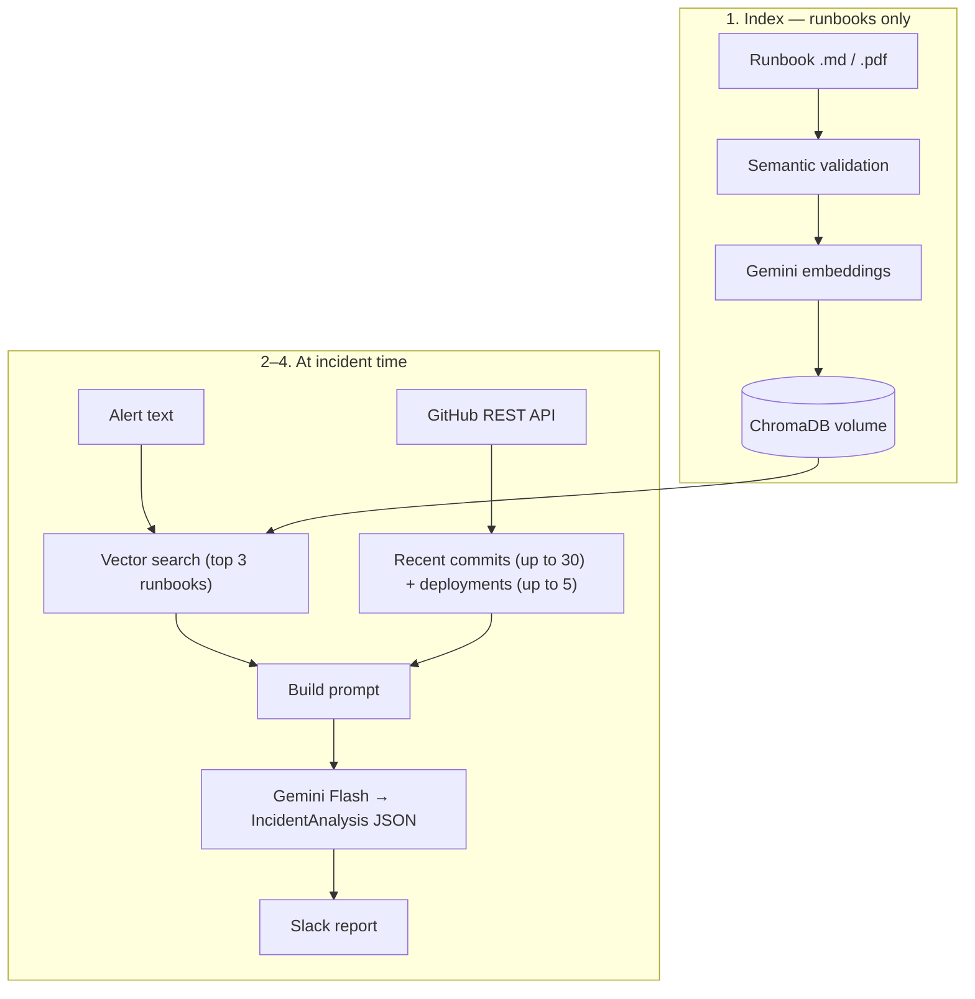

# SentinelAI

**Your incidents, resolved in seconds.**

SentinelAI is an autonomous incident-response copilot. When a production alert
fires, Sentinel investigates on its own: it scans your GitHub commit history to
find the likely bad change, searches your uploaded runbooks for the right fix
using semantic search, reasons over everything with Gemini, and posts a
concise, actionable incident report straight to your Slack channel — no human
trigger, no waiting for on-call to wake up.

The Slack alert looks like this:

```
🚨 Production Incident

Likely Cause:          Deployment #418
Confidence:            87%
Most Relevant Commit:  Fix authentication middleware
Affected Services:     API Gateway, Authentication
Suggested Runbook:     Authentication Outage Recovery
Next Steps:            Rollback deployment, Restart auth service
```

---

## How it works

```
Alert ─▶ FastAPI backend
             │
             ├─▶ GitHub API      → recent commits + deployments (listed in prompt — not vector search)
             ├─▶ ChromaDB        → vector search over runbooks only (Gemini embeddings)
             ├─▶ Gemini Flash    → picks likely bad commit + remediation from combined context
             └─▶ Slack Webhook   → formatted incident report in your channel
```

The **frontend** (React) lets a user sign up with a username, connect projects
(GitHub repo, Slack webhook, runbooks), manage account settings, and trigger
incident analyses. **Supabase** handles authentication, user profiles,
the projects database, and runbook file storage. The **backend** (FastAPI,
Docker) runs the AI incident pipeline and persists ChromaDB vectors on a
dedicated volume.

**Recommended production layout:** frontend on **Vercel**, backend on **Render**
(or any Docker host with a persistent volume). The backend is not a good fit for
serverless-only deploys because ChromaDB needs durable disk.

### Gemini models (two roles, one API key)

SentinelAI uses **two different Gemini models**, both via the same
`GEMINI_API_KEY`:

| Model (default) | Role | Used for |
| --------------- | ---- | -------- |
| **`gemini-embedding-001`** | Embeddings | Indexing runbooks in ChromaDB, semantic runbook search, and upload validation (checking the four required sections) |
| **`gemini-2.5-flash`** | Generation | Structured incident analysis (likely cause, confidence, next steps, Slack report) |

Override either default in `backend/.env.local`:

```env
GEMINI_EMBEDDING_MODEL=gemini-embedding-001
GEMINI_MODEL=gemini-2.5-flash
```

### RAG (Retrieval-Augmented Generation)

**RAG** means the LLM **retrieves** relevant documents from your own data, **augments** the prompt with that context, then **generates** an answer grounded in what it found.

In SentinelAI, **RAG applies to runbooks only.** Commits and deployments are
**not** embedded or vector-searched — they are fetched from the **GitHub REST
API** and passed to Gemini Flash as a plain list for the model to reason over.

The pipeline lives in `backend/app/services/incident_service.py`:



#### Runbooks vs commits — what uses vector search?

| Data | How it is fetched | Vector search? | How the “best” item is chosen |
| ---- | ------------------- | -------------- | ----------------------------- |
| **Runbooks** | Indexed in ChromaDB at upload | **Yes** | Alert text is embedded; top 3 runbooks by similarity (`chroma_service.search_runbooks`) |
| **Commits** | GitHub API — most recent N commits (`github_service.list_recent_commits`, default 30) | **No** | Gemini Flash reads commit messages in the prompt and sets `most_relevant_commit` |
| **Deployments** | GitHub API — recent deployments (`list_deployments`, limit 5) | **No** | Passed as context; helps Gemini tie the alert to a deployment |

So: **vector search finds relevant runbooks**; **the likely bad commit is inferred by Gemini** from the recent commit list, not from embedding similarity.

#### 1. Index (prepare the knowledge base)

When you upload a runbook or trigger analysis on a project:

1. The backend reads the file (`.md` or `.pdf` via `runbook_validation_service`).
2. **Validation** — before indexing, Gemini embeddings check that the document
   semantically covers all four required sections (not just exact headings).
3. **Embedding** — the full runbook text is embedded with
   `gemini-embedding-001` and stored in **ChromaDB** (`chroma_service.add_runbook`).
   Vectors persist on the Docker `chroma-data` volume.

This is the “knowledge base” RAG retrieves from later.

#### 2. Retrieve (find relevant runbooks)

On **Analyze Incident** (`POST /api/incidents/analyze`), the backend builds a
search query from the alert description (or deployment id, or a default phrase)
and calls `chroma_service.search_runbooks(query, n=3)`:

- The query is embedded with the **same** embedding model used at index time.
- ChromaDB returns the **top 3** runbooks by vector similarity (closest meaning,
  not keyword match).

#### 3. Augment (assemble context for the LLM)

Retrieved runbooks are combined with **GitHub context** (recent commits and
deployments) into a single prompt in `gemini_service._build_prompt`:

| Context added to the prompt | Source |
| --------------------------- | ------ |
| Incident signal (alert text, optional deployment) | User / monitoring |
| Recent commits | GitHub API |
| Recent deployments | GitHub API |
| Candidate runbook titles | Top ChromaDB matches from step 2 |

Semantic search runs against the **full runbook text** in ChromaDB; the
generation step passes the **titles** of the best matches so Gemini can pick a
`suggested_runbook` and stay focused.

#### 4. Generate (structured incident analysis)

**Gemini Flash** (`gemini-2.5-flash`) receives the augmented prompt and returns
structured JSON mapped to `IncidentAnalysis`:

- **`most_relevant_commit`** — chosen by the model from the **listed commit messages** (not vector search)
- **`suggested_runbook`** — chosen from the **vector-retrieved** runbook titles
- Plus likely cause, confidence, affected services, and next steps

That output is shown in the UI and optionally posted to Slack.

**Why RAG for runbooks?** Without retrieval, the model would invent runbook names
and fixes. Vector search grounds `suggested_runbook` in documents you uploaded.
Commit blame stays a separate step: recent history from GitHub + LLM reasoning.

---

## Project structure

```
SentinelAI/
├── src/                          # Frontend — React + Vite + Tailwind (dark/green theme)
│   ├── components/
│   │   ├── AppHeader.tsx         # Dashboard header (username, Settings, Sign out)
│   │   ├── AuthLayout.tsx        # Sign-in / sign-up shell
│   │   ├── DeleteAccountModal.tsx
│   │   ├── DeleteProjectModal.tsx
│   │   ├── PasswordRequirements.tsx
│   │   └── …                     # Navbar, Hero, Features, HowItWorks, etc.
│   ├── context/
│   │   └── AuthContext.tsx       # Supabase session + profile provider
│   ├── lib/
│   │   ├── supabase.ts           # Supabase client (auth, DB, storage)
│   │   ├── api.ts                # Client for the FastAPI backend
│   │   ├── profile.ts            # Profile helpers + login username lookup RPCs
│   │   ├── passwordValidation.ts
│   │   └── usernameValidation.ts
│   ├── pages/
│   │   ├── Landing.tsx
│   │   ├── Login.tsx             # Username or email + password
│   │   ├── SignUp.tsx            # Username, email, password + strength meter
│   │   ├── Dashboard.tsx         # Projects list, delete with sudo confirmation
│   │   ├── Settings.tsx          # Change username / email / password, delete account
│   │   ├── AddProject.tsx        # Create & edit projects + runbook upload
│   │   └── ProjectDetail.tsx     # Live incident analysis
│   ├── App.tsx
│   └── index.css
│
├── backend/                      # FastAPI incident-response service (Docker)
│   ├── app/
│   │   ├── main.py               # App factory, CORS (localhost + FRONTEND_URL + Vercel)
│   │   ├── config.py
│   │   ├── models/schemas.py
│   │   ├── services/
│   │   │   ├── github_service.py
│   │   │   ├── slack_service.py
│   │   │   ├── chroma_service.py
│   │   │   ├── gemini_service.py
│   │   │   ├── runbook_validation_service.py  # Semantic section checks + PDF parsing
│   │   │   └── incident_service.py
│   │   └── api/routes/           # health, github, runbooks, incidents
│   ├── requirements.txt
│   ├── Dockerfile
│   ├── docker-compose.yml        # Backend + chroma-data volume
│   └── .env.example
│
├── supabase/
│   └── schema.sql                # profiles, projects, RLS, storage, auth RPCs
│
├── index.html
├── package.json
├── vite.config.ts
├── .env.example
└── README.md

# Not in the repo — created at runtime:
#   chroma-data (Docker volume)   # ChromaDB vectors at /app/data/chroma in the container
```

> **Backend runs in Docker.** The FastAPI app (ChromaDB, Gemini, GitHub, Slack)
> is packaged into one image. Vector data lives in a **separate named volume**
> (`chroma-data`), not in the repo or image.

---

## Prerequisites

- **Docker** + **Docker Compose** — required for the backend (see §3)
- **Node.js** 18+ and npm (frontend)
- A **Supabase** account (free tier is fine)
- A **Gemini API key** — <https://aistudio.google.com/apikey>
- A **GitHub** personal access token (repo read)
- A **Slack** incoming webhook — create an app at <https://api.slack.com/apps>

---

## 1. Database setup (Supabase)

Supabase provides **authentication**, **user profiles**, the **projects
database**, and **runbook file storage**.

1. Go to <https://supabase.com/dashboard> and create a **New project**.
2. Open **SQL Editor → New query**, paste the **entire** contents of
   [`supabase/schema.sql`](supabase/schema.sql), and click **Run**. The file is
   idempotent (safe to re-run) and includes:

   | Section | What it sets up |
   | ------- | ---------------- |
   | 1–2 | `profiles` table (with **username**), Row Level Security |
   | 3 | Triggers: create `profiles` row **only after email confirmation** |
   | 4 | Backfill confirmed users; remove unconfirmed profile rows |
   | 5 | **`projects` table** + RLS |
   | 6 | **`runbooks` private storage bucket** + per-user policies |
   | RPCs | `resolve_login_email`, `is_username_available`, `update_username`, `delete_own_account` |

   **Username rules** (enforced in app + DB): max 20 characters, no spaces,
   unique case-insensitively.

3. Enable email auth: **Authentication → Providers → Email**.
4. Grab credentials for frontend `.env.local`:
   - **Publishable key**: Settings → API Keys → *Publishable and secret API keys*
   - **Project URL**: Integrations → Data API → base URL (drop `/rest/v1`)

   See [`.env.example`](.env.example) for step-by-step dashboard navigation.

---

## 2. Frontend setup

Configuration lives in **`.env.local`** at the repo root (Vite exposes `VITE_*`
variables only).

1. Create it from the template:

   ```bash
   cp .env.example .env.local
   ```

2. Fill in:

   ```env
   VITE_SUPABASE_URL=https://<project-ref>.supabase.co
   VITE_SUPABASE_PUBLISHABLE_KEY=sb_publishable_xxxxxxxxxxxx
   VITE_API_URL=http://localhost:8000
   ```

3. Install and run:

   ```bash
   npm install
   npm run dev                    # http://localhost:8443
   ```

> Restart the dev server after changing `.env.local`. In production (e.g.
> Vercel), set the same three variables; point `VITE_API_URL` at your deployed
> backend URL.

### Account & UI features

| Area | Behavior |
| ---- | -------- |
| **Sign up** | Username (required), email, password with live strength meter; if email exists but unverified, resends confirmation instead of “try logging in” |
| **Log in** | **Username or email** + password; blocked until email is verified (resend link offered) |
| **Verify email** | `/verify-email` — resend confirmation or sign out; dashboard and protected routes require verified email |
| **Dashboard** | Shows **username** (not email) in the header; **Settings** + red **Sign out** |
| **Settings** | Change username (instant), email (confirmation to new address), password (new + confirm); delete account via `sudo delete [username]` modal |
| **Projects** | Create/edit with GitHub repo, Slack webhook ([get one from Slack apps](https://api.slack.com/apps)), runbooks |
| **Delete project** | In-app modal: confirm → type `sudo delete [Project Name]` |
| **Runbooks** | `.md` or `.pdf`; must include four sections (validated semantically on upload) |

---

## 3. Backend setup (Docker)

ChromaDB and native AI/HTTP dependencies run in a container so behavior is
consistent everywhere. Indexed runbooks persist in the **`chroma-data`** volume.

1. Configure `backend/.env.local`:

   ```bash
   cd backend
   cp .env.example .env.local
   ```

   ```env
   GEMINI_API_KEY=your-gemini-api-key
   GITHUB_TOKEN=your-github-pat
   SLACK_WEBHOOK_URL=https://hooks.slack.com/services/XXX/YYY/ZZZ   # optional fallback
   FRONTEND_URL=http://localhost:8443                               # production: your Vercel URL
   # Optional Gemini model overrides (defaults shown):
   # GEMINI_EMBEDDING_MODEL=gemini-embedding-001   # runbook vectors + validation
   # GEMINI_MODEL=gemini-2.5-flash                 # incident analysis
   ```

2. Build and start:

   ```bash
   docker compose up --build      # http://localhost:8000
   ```

   - API: <http://localhost:8000>
   - Docs: <http://localhost:8000/docs>

```bash
docker compose down              # stop (keeps ChromaDB volume)
docker compose down -v           # stop and wipe indexed runbooks
```

---

## 4. Production deployment (Vercel + Render)

| Service | Role | Required env |
| ------- | ---- | -------------- |
| **Vercel** | Frontend SPA | `VITE_SUPABASE_URL`, `VITE_SUPABASE_PUBLISHABLE_KEY`, **`VITE_API_URL`** (Render backend URL) |
| **Render** | Backend Docker | `GEMINI_API_KEY`, `GITHUB_TOKEN`, **`FRONTEND_URL`** (Vercel URL, no trailing slash) |
| **Supabase** | Auth + DB + storage | Run `schema.sql`; configure auth URLs (below) |

### Supabase auth URLs (fixes email verification on production)

**If the confirmation link opens `localhost:3000`, that is a Supabase dashboard
setting — not your Vercel app.** Supabase defaults Site URL to
`http://localhost:3000`. Our app runs on port **8443** locally and your **Vercel
URL** in production.

Fix in **Supabase → Authentication → URL Configuration**:

| Setting | Change from | Change to |
| ------- | ----------- | --------- |
| **Site URL** | `http://localhost:3000` | `https://your-app.vercel.app` |
| **Redirect URLs** | (add these) | `https://your-app.vercel.app/auth/callback` |
| | | `http://localhost:8443/auth/callback` |
| | | `https://*.vercel.app/auth/callback` (optional previews) |

Then **sign up again** (or resend confirmation) — old emails still contain the old
localhost link.

The app also passes `emailRedirectTo` in code (`SignUp.tsx`, `Settings.tsx`) pointing
at `/auth/callback` on whatever origin you signed up from.

### Email confirmation and the database

- **Before verify:** Supabase Auth stores a pending row in `auth.users` (required
  for sending the email). **`public.profiles` is not created yet.**
- **After verify:** A database trigger (and `/auth/callback`) creates your row in
  `profiles` with your username. Only then can you use the dashboard.

**Email template (recommended):** In **Supabase → Authentication → Email Templates →
Confirm signup**, replace the default link with a direct app callback so confirmation
works when opened from any browser or device (avoids PKCE “code verifier not found”):

```html
<h2>Confirm your signup</h2>
<p><a href="{{ .SiteURL }}/auth/callback?token_hash={{ .TokenHash }}&type=signup">Confirm your email</a></p>
```

Set **Site URL** to your production Vercel URL. After changing the template, **sign up
again** or use **Resend confirmation email** so new links use the updated format.

Re-run the updated [`supabase/schema.sql`](supabase/schema.sql) in the SQL Editor
to apply the deferred-profile triggers and remove any old unconfirmed profile rows.

### Vercel

1. Add env vars above; **`VITE_API_URL` must be your Render URL** (not localhost).
2. Redeploy after changing env vars (Vite bakes `VITE_*` at build time).
3. `vercel.json` rewrites all routes to `index.html` so `/auth/callback` and
   `/dashboard` work on refresh.

### Render

1. Deploy from `backend/Dockerfile`; attach a **persistent disk** at `/app/data/chroma`
   so indexed runbooks survive restarts.
2. Set **`FRONTEND_URL=https://your-app.vercel.app`** for CORS (regex also allows
   `https://*.vercel.app` previews).

### What breaks if misconfigured

| Symptom | Likely cause |
| ------- | ------------- |
| Email link opens localhost | Supabase Site URL still localhost; add production redirect URLs |
| Email confirm lands on 404 | Missing `vercel.json` SPA rewrite or redirect URL not allowlisted |
| PKCE code verifier not found | Update the Confirm signup email template (see above) and resend confirmation |
| Runbook upload / analyze fails | `VITE_API_URL` unset on Vercel → browser calls localhost |
| CORS error from frontend | `FRONTEND_URL` missing/wrong on Render |

---

## Environment variables reference

**Frontend** (`.env.local`)

| Variable | Required | Purpose |
| -------- | -------- | ------- |
| `VITE_SUPABASE_URL` | yes | Supabase project URL |
| `VITE_SUPABASE_PUBLISHABLE_KEY` | yes | Browser-safe Supabase key |
| `VITE_API_URL` | **yes in prod.** | Render backend URL — **required on Vercel**; defaults to `http://localhost:8000` in dev only |

**Backend** (`backend/.env.local`)

| Variable | Required | Purpose |
| -------- | -------- | ------- |
| `GEMINI_API_KEY` | yes | Powers both Gemini models below |
| `GEMINI_EMBEDDING_MODEL` | optional | Runbook embeddings + validation (default `gemini-embedding-001`) |
| `GEMINI_MODEL` | optional | Incident analysis (default `gemini-2.5-flash`) |
| `GITHUB_TOKEN` | rec. | Rate limits; private repos |
| `SLACK_WEBHOOK_URL` | optional | Global fallback webhook |
| `FRONTEND_URL` | prod. | CORS allowlist for your frontend |

---

## API overview

| Method | Path | Description |
| ------ | ---- | ----------- |
| GET | `/health` | Liveness + configured integrations |
| GET | `/api/github/commits` | Recent commits for `?repo=owner/name` |
| GET | `/api/github/deployments` | Recent deployments |
| POST | `/api/runbooks/validate-file` | Upload `.md`/`.pdf`; semantic section validation |
| POST | `/api/runbooks/index-file` | Parse + index a runbook file into ChromaDB |
| POST | `/api/runbooks` | Index runbook JSON body |
| GET | `/api/runbooks/search` | Semantic search (`?q=...`) |
| POST | `/api/incidents/analyze` | Full pipeline → analysis + optional Slack post |
| POST | `/api/incidents/notify` | Post a pre-built analysis to Slack |

Interactive docs: <http://localhost:8000/docs>

### Runbook requirements (upload validation)

Each runbook must cover these four topics (checked semantically, not just by
heading text):

1. How to set up and run the service
2. How to test or verify that it works
3. What common errors or symptoms to look for
4. What action to take for each error

### Example: analyze an incident

```bash
curl -X POST http://localhost:8000/api/incidents/analyze \
  -H 'Content-Type: application/json' \
  -d '{
    "github_repo": "your-org/your-repo",
    "description": "5xx spike on the API gateway after the latest deploy",
    "slack_webhook_url": "https://hooks.slack.com/services/XXX/YYY/ZZZ",
    "deployment": "418"
  }'
```

---

## Typical workflow

1. Run `supabase/schema.sql`, configure `.env.local` files, start backend
   (`docker compose up --build`) and frontend (`npm run dev`).
2. **Sign up** with a username, email, and strong password.
3. On the dashboard, click **New Project** — add a GitHub repo, Slack webhook
   (from <https://api.slack.com/apps>), and upload runbooks (`.md` / `.pdf`).
4. Open the project and click **Analyze Incident**. Sentinel validates and
   indexes runbooks, scans commits, reasons with Gemini, shows results on the
   page, and posts to Slack when a webhook is configured.
5. Use **Settings** (header) to update username, email, or password, or delete
   your account. Delete a project from the dashboard trash icon (requires
   `sudo delete [Project Name]`).
