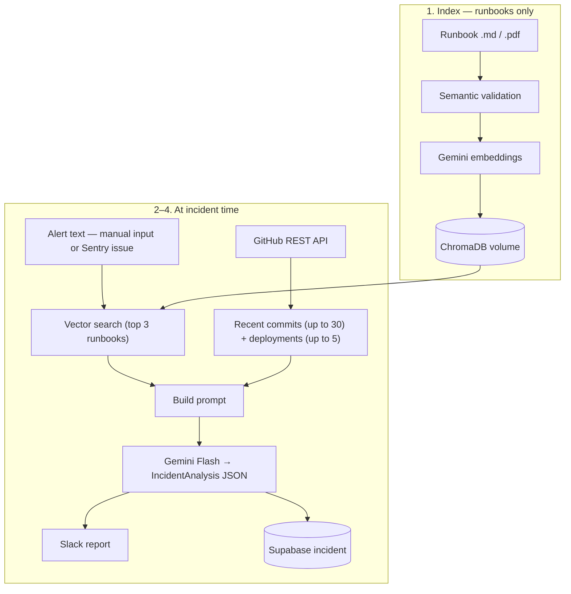
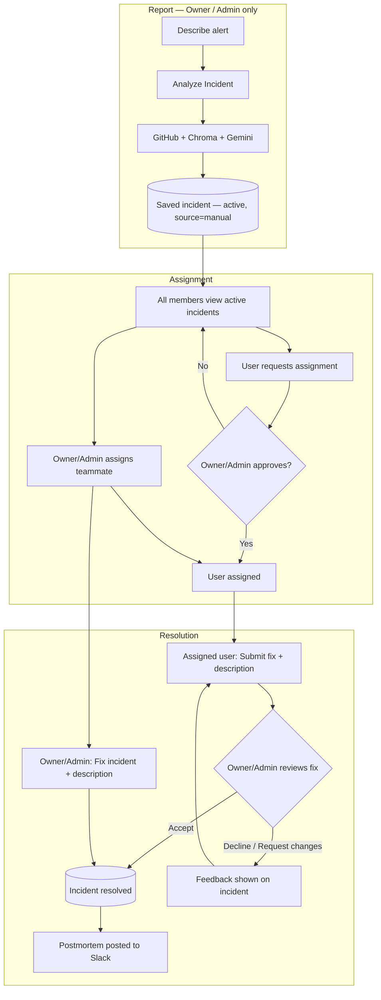
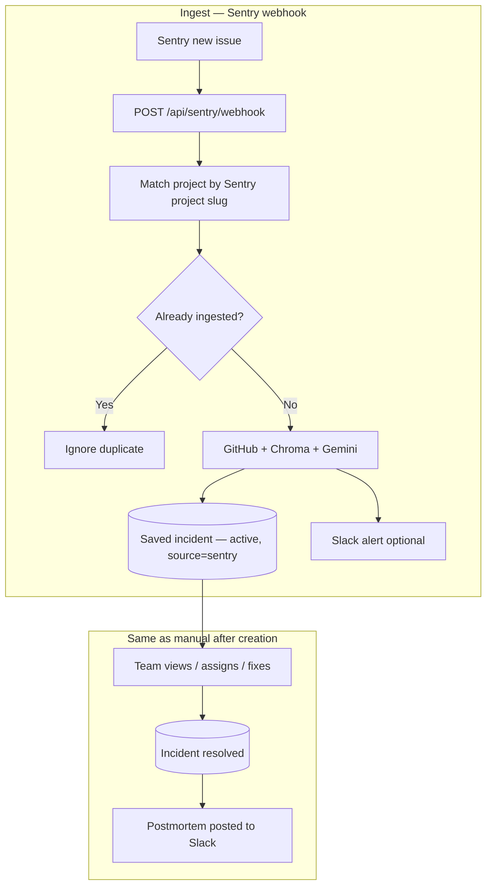
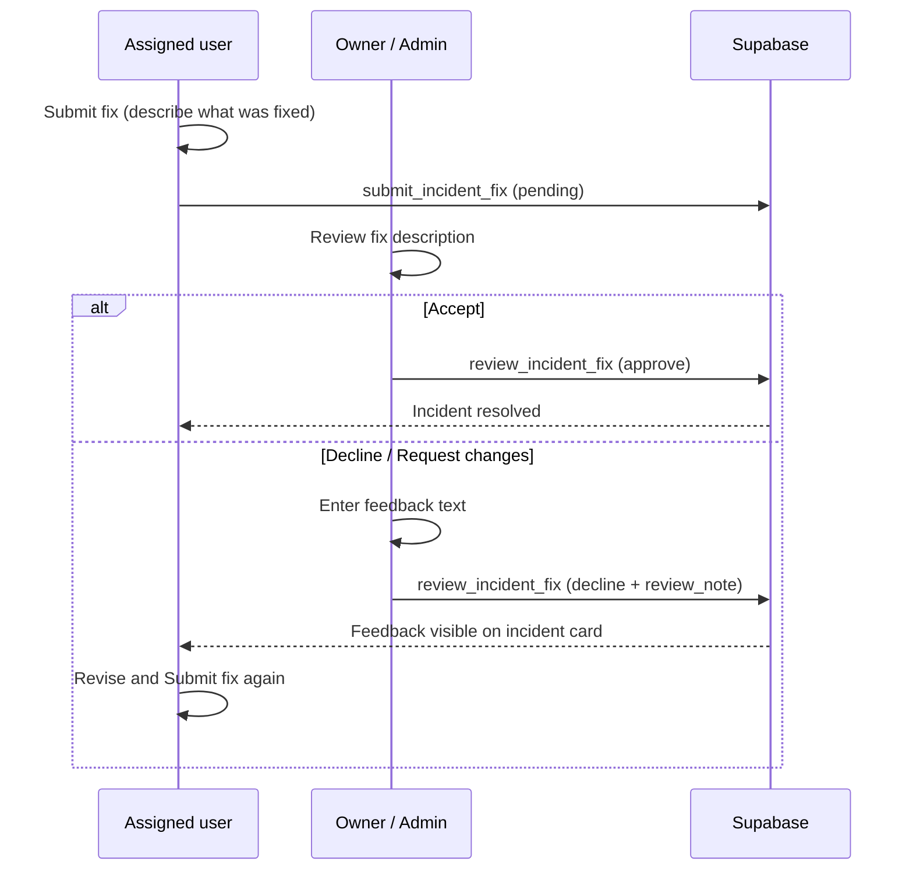

# SentinelAI

**Your incidents, resolved in seconds.**

SentinelAI is an autonomous incident-response copilot. When a production alert
fires, Sentinel investigates on its own: it scans your GitHub commit history to
find the likely bad change, searches your uploaded runbooks for the right fix
using semantic search, reasons over everything with Gemini, and posts a
concise, actionable incident report straight to your Slack channel — no human
trigger, no waiting for on-call to wake up.

The Slack alert looks like this:

```
🚨 Production Incident

Likely Cause:          Deployment #418
Confidence:            87%
Most Relevant Commit:  Fix authentication middleware
Affected Services:     API Gateway, Authentication
Suggested Runbook:     Authentication Outage Recovery
Next Steps:            Rollback deployment, Restart auth service
```

---

## How it works

SentinelAI supports two **incident trigger modes** per project:

| Mode | How an incident starts | Who triggers analysis |
| ---- | ------------------------ | --------------------- |
| **Manual trigger** (default) | Owner/admin describes an alert in the UI | Human clicks **Analyze Incident** |
| **Autonomous** | Sentry reports a **new issue** via webhook | Backend receives webhook → runs pipeline automatically |

Both modes use the **same analysis pipeline** (GitHub → Chroma runbooks → Gemini → optional Slack). Only the **entry point** differs.

### Manual trigger — high-level flow

```
Owner/admin describes alert ─▶ FastAPI backend
                                    │
                                    ├─▶ GitHub API      → recent commits + deployments
                                    ├─▶ ChromaDB        → vector search over runbooks
                                    ├─▶ Gemini Flash    → structured incident analysis
                                    └─▶ Slack Webhook   → formatted incident report
                                        │
                                        └─▶ Incident saved in Supabase (frontend)
```

### Autonomous trigger — high-level flow

```
Sentry new issue ─▶ POST /api/sentry/webhook (backend)
                         │
                         ├─▶ Match SentinelAI project (Sentry org/project link)
                         ├─▶ GitHub API + ChromaDB + Gemini (same pipeline)
                         ├─▶ Slack Webhook (optional)
                         └─▶ Incident saved in Supabase (service role, source=sentry)
```

The **frontend** (React) lets users sign up with a username, create and join
projects (GitHub repo, Slack webhook, runbooks — **validated against GitHub and
Slack before save**), connect **Sentry** for autonomous mode, collaborate via **roles and invitations**, manage account
settings, and run **owner/admin-controlled incident workflows** with assignment
and fix approval. **Supabase** handles authentication, profiles,
projects, team membership, invitations, persisted incidents, and runbook
storage. The **backend** (FastAPI, Docker) runs the AI incident pipeline,
Sentry OAuth/webhooks, and persists ChromaDB vectors on a dedicated volume.

**Recommended production layout:** frontend on **Vercel**, backend on **Render**
(or any Docker host with a persistent volume). The backend is not a good fit for
serverless-only deploys because ChromaDB needs durable disk.

### Gemini models (two roles, one API key)

SentinelAI uses **two different Gemini models**, both via the same
`GEMINI_API_KEY`:

| Model (default) | Role | Used for |
| --------------- | ---- | -------- |
| **`gemini-embedding-001`** | Embeddings | Indexing runbooks in ChromaDB, semantic runbook search, and upload validation (checking the four required sections) |
| **`gemini-2.5-flash`** | Generation | Structured incident analysis (likely cause, confidence, next steps, Slack report) |

Override either default in `backend/.env.local`:

```env
GEMINI_EMBEDDING_MODEL=gemini-embedding-001
GEMINI_MODEL=gemini-2.5-flash
```

### RAG (Retrieval-Augmented Generation)

**RAG** means the LLM **retrieves** relevant documents from your own data, **augments** the prompt with that context, then **generates** an answer grounded in what it found.

In SentinelAI, **RAG applies to runbooks only.** Commits and deployments are
**not** embedded or vector-searched — they are fetched from the **GitHub REST
API** and passed to Gemini Flash as a plain list for the model to reason over.

The pipeline lives in `backend/app/services/incident_service.py` and is shared by **manual** and **autonomous** triggers:

#### Shared analysis pipeline (manual + autonomous)


```mermaid
flowchart TB
  subgraph index [1. Index — runbooks only]
    RB[Runbook .md / .pdf] --> VAL[Semantic validation]
    VAL --> EMB[Gemini embeddings]
    EMB --> CHROMA[(ChromaDB volume)]
  end

  subgraph incident [2–4. At incident time]
    ALERT[Alert text — manual input or Sentry issue] --> VSEARCH["Vector search (top 3 runbooks)"]
    CHROMA --> VSEARCH

    GH["GitHub REST API"] --> RECENT["Recent commits (up to 30) + deployments (up to 5)"]

    VSEARCH --> PROMPT[Build prompt]
    RECENT --> PROMPT
    PROMPT --> GEN["Gemini Flash → IncidentAnalysis JSON"]
    GEN --> SLACK[Slack report]
    GEN --> SAVE[(Supabase incident)]
  end
```

#### Runbooks vs commits — what uses vector search?

| Data | How it is fetched | Vector search? | How the “best” item is chosen |
| ---- | ------------------- | -------------- | ----------------------------- |
| **Runbooks** | Indexed in ChromaDB at upload | **Yes** | Alert text is embedded; top 3 runbooks by similarity (`chroma_service.search_runbooks`) |
| **Commits** | GitHub API — most recent N commits (`github_service.list_recent_commits`, default 30) | **No** | Gemini Flash reads commit messages in the prompt and sets `most_relevant_commit` |
| **Deployments** | GitHub API — recent deployments (`list_deployments`, limit 5) | **No** | Passed as context; helps Gemini tie the alert to a deployment |

So: **vector search finds relevant runbooks**; **the likely bad commit is inferred by Gemini** from the recent commit list, not from embedding similarity.

#### 1. Index (prepare the knowledge base)

When you upload a runbook or trigger analysis on a project:

1. The backend reads the file (`.md` or `.pdf` via `runbook_validation_service`).
2. **Validation** — before indexing, Gemini embeddings check that the document
   semantically covers all four required sections (not just exact headings).
3. **Embedding** — the full runbook text is embedded with
   `gemini-embedding-001` and stored in **ChromaDB** (`chroma_service.add_runbook`).
   Vectors persist on the Docker `chroma-data` volume.

This is the “knowledge base” RAG retrieves from later.

#### 2. Retrieve (find relevant runbooks)

On **Analyze Incident** (`POST /api/incidents/analyze`), the backend builds a
search query from the alert description (or deployment id, or a default phrase)
and calls `chroma_service.search_runbooks(query, n=3)`:

- The query is embedded with the **same** embedding model used at index time.
- ChromaDB returns the **top 3** runbooks by vector similarity (closest meaning,
  not keyword match).

#### 3. Augment (assemble context for the LLM)

Retrieved runbooks are combined with **GitHub context** (recent commits and
deployments) into a single prompt in `gemini_service._build_prompt`:

| Context added to the prompt | Source |
| --------------------------- | ------ |
| Incident signal (alert text, optional deployment) | User / monitoring |
| Recent commits | GitHub API |
| Recent deployments | GitHub API |
| Candidate runbook titles | Top ChromaDB matches from step 2 |

Semantic search runs against the **full runbook text** in ChromaDB; the
generation step passes the **titles** of the best matches so Gemini can pick a
`suggested_runbook` and stay focused.

#### 4. Generate (structured incident analysis)

**Gemini Flash** (`gemini-2.5-flash`) receives the augmented prompt and returns
structured JSON mapped to `IncidentAnalysis`:

- **`most_relevant_commit`** — chosen by the model from the **listed commit messages** (not vector search)
- **`suggested_runbook`** — chosen from the **vector-retrieved** runbook titles
- Plus likely cause, confidence, affected services, and next steps

That output is shown in the UI and optionally posted to Slack. If the webhook is
invalid or revoked, analysis and incident save still succeed; Slack failure is
returned as `slack_error` and shown as a warning on the project page.

**Why RAG for runbooks?** Without retrieval, the model would invent runbook names
and fixes. Vector search grounds `suggested_runbook` in documents you uploaded.
Commit blame stays a separate step: recent history from GitHub + LLM reasoning.

---

## Project structure

```
SentinelAI/
├── src/                          # Frontend — React + Vite + Tailwind (dark/green theme)
│   ├── components/
│   │   ├── AppHeader.tsx         # Dashboard header (username, notifications, Settings, Sign out)
│   │   ├── AuthLayout.tsx        # Sign-in / sign-up shell
│   │   ├── DeleteAccountModal.tsx
│   │   ├── DeleteProjectModal.tsx
│   │   ├── LeaveProjectModal.tsx
│   │   ├── TransferOwnershipModal.tsx
│   │   ├── NotificationBell.tsx  # Pending project invitations (accept / decline)
│   │   ├── ProjectTeamModal.tsx  # Team & permissions modal
│   │   ├── ProjectTeamSection.tsx
│   │   ├── ProjectEditRequestsSection.tsx
│   │   ├── ResolveIncidentModal.tsx
│   │   ├── PasswordRequirements.tsx
│   │   └── …                     # Navbar, Hero, Features, HowItWorks, etc.
│   ├── context/
│   │   ├── AuthContext.tsx       # Supabase session + profile provider
│   │   └── PendingInvitationsContext.tsx
│   ├── lib/
│   │   ├── supabase.ts           # Supabase client (auth, DB, storage)
│   │   ├── api.ts                # Client for the FastAPI backend
│   │   ├── projectTeam.ts        # Roles, invites, incidents, fixes, edit requests
│   │   ├── profile.ts            # Profile helpers + login username lookup RPCs
│   │   ├── passwordValidation.ts
│   │   └── usernameValidation.ts
│   ├── pages/
│   │   ├── Landing.tsx
│   │   ├── Login.tsx             # Username or email + password
│   │   ├── SignUp.tsx            # Username, email, password + strength meter
│   │   ├── Dashboard.tsx         # Owned + shared projects, role badges, delete (owner)
│   │   ├── Settings.tsx          # Change username / email / password, delete account
│   │   ├── AddProject.tsx        # Create & edit projects + runbook upload / edit requests
│   │   └── ProjectDetail.tsx     # Incidents, team header actions, fix reviews
│   ├── App.tsx
│   └── index.css
│
├── backend/                      # FastAPI incident-response service (Docker)
│   ├── app/
│   │   ├── main.py               # App factory, CORS (localhost + FRONTEND_URL + Vercel)
│   │   ├── config.py
│   │   ├── models/schemas.py
│   │   ├── services/
│   │   │   ├── github_service.py
│   │   │   ├── slack_service.py
│   │   │   ├── chroma_service.py
│   │   │   ├── gemini_service.py
│   │   │   ├── runbook_validation_service.py  # Semantic section checks + PDF parsing
│   │   │   └── incident_service.py
│   │   └── api/routes/           # health, github, slack, runbooks, incidents
│   ├── requirements.txt
│   ├── Dockerfile
│   ├── docker-compose.yml        # Backend + chroma-data volume
│   └── .env.example
│
├── supabase/
│   └── schema.sql                # profiles, projects, teams, incidents, RLS, RPCs
│
├── index.html
├── package.json
├── vite.config.ts
├── .env.example
└── README.md

# Not in the repo — created at runtime:
#   chroma-data (Docker volume)   # ChromaDB vectors at /app/data/chroma in the container
```

> **Backend runs in Docker.** The FastAPI app (ChromaDB, Gemini, GitHub, Slack)
> is packaged into one image. Vector data lives in a **separate named volume**
> (`chroma-data`), not in the repo or image.

---

## Prerequisites

- **Docker** + **Docker Compose** — required for the backend (see §3)
- **Node.js** 18+ and npm (frontend)
- A **Supabase** account (free tier is fine)
- A **Gemini API key** — <https://aistudio.google.com/apikey>
- A **GitHub** personal access token (repo read)
- A **Slack** incoming webhook — create an app at <https://api.slack.com/apps>

---

## 1. Database setup (Supabase)

Supabase provides **authentication**, **user profiles**, the **projects
database**, and **runbook file storage**.

1. Go to <https://supabase.com/dashboard> and create a **New project**.
2. Open **SQL Editor → New query**, paste the **entire** contents of
   [`supabase/schema.sql`](supabase/schema.sql), and click **Run**. The file is
   idempotent (safe to re-run) and includes:

   | Section | What it sets up |
   | ------- | ---------------- |
   | 1–2 | `profiles` table (with **username**), Row Level Security |
   | 3 | Triggers: create `profiles` row **only after email confirmation** |
   | 4 | Backfill confirmed users; remove unconfirmed profile rows |
   | 5 | **`projects` table** + RLS |
   | 6 | **`runbooks` private storage bucket** + per-user policies |
   | 7 | **`project_members`**, **`project_invitations`**, **`incidents`**, **`incident_fixes`** + team/incident RPCs |
   | 8 | **`project_edit_requests`**, ownership transfer, leave project, role management |
   | **9** | **Security hardening** — stricter RLS on `projects` / `project_members`, `can_access_project`, and **`SECURITY DEFINER`** RPCs so invited users can list and open shared projects (see [Row Level Security](#row-level-security-rls) below) |
   | **10** | **Incident assignment workflow** — `assigned_to` on incidents, `incident_assignment_requests`, admin-only incident creation, assign / request / review RPCs (see [Incidents & fixes](#incidents--fixes)) |
   | **11** | **Fix review feedback** — `review_incident_fix` requires feedback when declining / requesting changes |
   | **12** | **Postmortem metadata** — `runbook_matches`, `postmortem_posted`, `assigned_at`, `mark_postmortem_posted` RPC |
   | **13** | **`trigger_mode`** on projects (`manual` \| `autonomous`) |
   | **14** | **Sentry connections** — `project_sentry_connections`, `sentry_oauth_pending`, `get_project_sentry_status` |
   | **15** | **Pre-project Sentry OAuth** — nullable `project_id` on pending OAuth rows |
   | **16** | **`trigger_mode` in `get_accessible_project`** (drop + recreate RPC) |
   | **17** | **Sentry incidents** — `incidents.source`, `incidents.sentry_issue_id`, dedup index |
   | RPCs | Auth: `resolve_login_email`, `is_username_available`, `update_username`, `delete_own_account` |
   | | Teams: `invite_project_member`, `accept_project_invitation`, `get_my_pending_invitations`, `transfer_project_ownership`, `leave_project`, … |
   | | Access: **`get_my_projects()`**, **`get_accessible_project(uuid)`**, `get_my_project_role(uuid)` |

   **Important:** If you set up the database before team/invite fixes landed, re-run the full
   [`supabase/schema.sql`](supabase/schema.sql) in the SQL Editor (it is idempotent). Section **9**
   at the bottom must be applied so invitees see shared projects with the correct role.

   **Username rules** (enforced in app + DB): max 20 characters, no spaces,
   unique case-insensitively.

3. Enable email auth: **Authentication → Providers → Email**.
4. Grab credentials for frontend `.env.local`:
   - **Publishable key**: Settings → API Keys → *Publishable and secret API keys*
   - **Project URL**: Integrations → Data API → base URL (drop `/rest/v1`)

   See [`.env.example`](.env.example) for step-by-step dashboard navigation.

### Row Level Security (RLS)

Supabase **Row Level Security** controls which rows each signed-in user can read or
write. SentinelAI uses RLS on `profiles`, `projects`, `project_members`,
invitations, incidents, and related tables so users only see data for projects
they own or were invited to.


Section **9** in [`supabase/schema.sql`](supabase/schema.sql) fhas:

| Piece | Purpose |
| ----- | ------- |
| **`can_access_project(project_id)`** | `SECURITY DEFINER` helper — true if the current user is the project owner or a member |
| **RLS on `projects`** | Select allowed for owners **or** members (not every authenticated user) |
| **RLS on `project_members`** | Users can read **their own** membership rows; teammates can list the team when `can_access_project` passes |
| **`get_my_projects()`** | `SECURITY DEFINER` — returns owned projects (role `owner`) **union** joined projects (role `admin` / `user`) for the dashboard |
| **`get_accessible_project(uuid)`** | `SECURITY DEFINER` — returns one project + **`my_role`** if the caller may open it; used on the project detail page |
| **`get_my_project_role(uuid)`** | Resolves owner vs admin vs user for permission checks in the UI |

The frontend (`src/lib/projectTeam.ts`) calls these RPCs first and falls back to
direct table queries only when needed. Project detail loading uses
`.maybeSingle()` and checks role **before** rendering owner-only actions.

**Re-run section 9** after pulling updates if invitees still cannot see shared
projects or if everyone incorrectly appears as Owner.

---

## 2. Frontend setup

Configuration lives in **`.env.local`** at the repo root (Vite exposes `VITE_*`
variables only).

1. Create it from the template:

   ```bash
   cp .env.example .env.local
   ```

2. Fill in:

   ```env
   VITE_SUPABASE_URL=https://<project-ref>.supabase.co
   VITE_SUPABASE_PUBLISHABLE_KEY=sb_publishable_xxxxxxxxxxxx
   VITE_API_URL=http://localhost:8000
   ```

3. Install and run:

   ```bash
   npm install
   npm run dev                    # http://localhost:8443
   ```

> Restart the dev server after changing `.env.local`. In production (e.g.
> Vercel), set the same three variables; point `VITE_API_URL` at your deployed
> backend URL.

### Account & UI features

| Area | Behavior |
| ---- | -------- |
| **Sign up** | Username (required), email, password with live strength meter; if email exists but unverified, resends confirmation instead of “try logging in” |
| **Log in** | **Username or email** + password; blocked until email is verified (resend link offered) |
| **Verify email** | `/verify-email` — resend confirmation or sign out; dashboard and protected routes require verified email |
| **Dashboard header** | Shows **username**; **notifications bell** (pending project invites); **Settings**; red **Sign out** |
| **Settings** | Change username (instant), email (confirmation to new address), password (new + confirm); delete account via `sudo delete [username]` modal |
| **Projects** | Create/edit with GitHub repo, Slack webhook ([get one from Slack apps](https://api.slack.com/apps)), runbooks — **GitHub repo and Slack webhook are verified by the backend before save** (see [Integration validation](#integration-validation-github--slack)) |
| **Delete project** | Owner only — dashboard trash icon → confirm → type `sudo delete [Project Name]` |
| **Runbooks** | `.md` or `.pdf`; must include four sections (validated semantically on upload) |

### Projects, teams & permissions

Each project has three roles. The dashboard lists projects you **own** and projects you **joined** as admin or user, with a role badge on each card.

| Role | Label in UI | What they can do |
| ---- | ----------- | ---------------- |
| **Owner** | Owner | Delete the project, transfer ownership, promote/demote admins, invite teammates, remove members, approve edit requests, **report/analyze incidents**, assign incidents, review assignment requests and incident fixes, fix incidents directly |
| **Admin** | Admin | Invite teammates, remove **users** (not other admins), submit **edit requests** for owner approval, **report/analyze incidents**, assign incidents, review assignment requests and incident fixes, fix incidents directly |
| **Member** | User | View active incidents and AI analysis, **request assignment** to an incident (owner/admin must approve), submit fixes **only when assigned** (owner/admin must approve before resolve) |

**Invitations**

- Owners and admins invite by **username or email** from the **Team & permissions** modal (project page header: green **Invite** button).
- The invitee must already be a **registered SentinelAI user** (confirmed account). Otherwise the app shows: *Invalid user/email. Please ask them to register to SentinelAI*.
- Pending invites appear in the **notifications bell** (dashboard header, before Settings). Accept or decline from the dropdown; the list refreshes on focus and every 30 seconds.
- Inviters see pending invites inside the team modal; hover a row to reveal a cancel (**×**) button.

**Team modal** (project page)

- Open via **Invite** (owners/admins) or **Team** (members — view-only team list).
- Each member row shows a **role dropdown** (when you have permission): set **User** / **Admin**, **Make owner**, or **Remove access**.
- Only the **owner** can change someone between User and Admin, transfer ownership, or remove admins.
- Admins can remove **users** only.

**Destructive confirmations** (two-step modals with smooth fade/slide transitions)

| Action | Who | Step 1 | Step 2 — type exactly |
| ------ | --- | ------ | --------------------- |
| Delete account | Any user | Warning | `sudo delete [username]` |
| Delete project | Owner | Warning | `sudo delete [Project Name]` |
| Transfer ownership | Owner | Warning (irreversible unless new owner transfers back) | `sudo chown [username]` |
| Leave project | Admin or user | Warning (rejoin only by re-invite) | `sudo deluser [username] [Project Name]` |

**Leave project** is in the **project page header**, to the right of **Invite** / **Team** (not inside the team modal).

**Project edits by admins**

- Admins cannot change project settings directly. **Add/Edit Project** submits a **request**; the owner approves or declines on the project detail page.

**Incidents & fixes**

Only **owners and admins** can describe an alert and run **Analyze Incident** on **manual-trigger** projects (the RAG pipeline: GitHub commits → Chroma runbook search → Gemini → optional Slack). Regular **users** cannot trigger analysis — this prevents low-privilege members from injecting arbitrary alert text into the pipeline.

**Autonomous** projects do not use the manual report form. Sentry **issue.created** webhooks hit `POST /api/sentry/webhook`; the backend runs the same pipeline and saves incidents with `source = sentry`.

#### Manual incident workflow


```mermaid
flowchart TB
  subgraph report [Report — Owner / Admin only]
    ALERT[Describe alert] --> ANALYZE[Analyze Incident]
    ANALYZE --> RAG[GitHub + Chroma + Gemini]
    RAG --> SAVE[(Saved incident — active, source=manual)]
  end

  subgraph assign [Assignment]
    SAVE --> VIEW[All members view active incidents]
    VIEW --> ADMIN_ASSIGN[Owner/Admin assigns teammate]
    VIEW --> USER_REQ[User requests assignment]
    USER_REQ --> ADMIN_APPROVE{Owner/Admin approves?}
    ADMIN_APPROVE -->|Yes| ASSIGNED[User assigned]
    ADMIN_APPROVE -->|No| VIEW
    ADMIN_ASSIGN --> ASSIGNED
  end

  subgraph resolve [Resolution]
    ASSIGNED --> USER_FIX[Assigned user: Submit fix + description]
    ADMIN_ASSIGN --> ADMIN_FIX[Owner/Admin: Fix incident + description]
    USER_FIX --> FIX_REVIEW{Owner/Admin reviews fix}
    FIX_REVIEW -->|Accept| RESOLVED[(Incident resolved)]
    FIX_REVIEW -->|Decline / Request changes| FEEDBACK[Feedback shown on incident]
    FEEDBACK --> USER_FIX
    ADMIN_FIX --> RESOLVED
    RESOLVED --> POSTMORTEM[Postmortem posted to Slack]
  end
```

#### Autonomous incident workflow


```mermaid
flowchart TB
  subgraph ingest [Ingest — Sentry webhook]
    SENTRY[Sentry new issue] --> WH[POST /api/sentry/webhook]
    WH --> MATCH[Match project by Sentry project slug]
    MATCH --> DEDUP{Already ingested?}
    DEDUP -->|Yes| SKIP[Ignore duplicate]
    DEDUP -->|No| RAG[GitHub + Chroma + Gemini]
    RAG --> SAVE[(Saved incident — active, source=sentry)]
    RAG --> SLACK[Slack alert optional]
  end

  subgraph after [Same as manual after creation]
    SAVE --> VIEW[Team views / assigns / fixes]
    VIEW --> RESOLVED[(Incident resolved)]
    RESOLVED --> POSTMORTEM[Postmortem posted to Slack]
  end
```

**Sentry setup for autonomous projects**

SentinelAI needs **two separate Sentry configurations**. They live in different places in Sentry and use different env vars.

| Purpose | Where in Sentry | Env vars |
| ------- | --------------- | -------- |
| Users click **Connect Sentry** in SentinelAI | **Developer Settings → OAuth Applications** | `SENTRY_CLIENT_ID`, `SENTRY_CLIENT_SECRET`, `SENTRY_REDIRECT_URI` |
| Sentry sends new-issue webhooks to SentinelAI | **Custom Integrations** (Internal Integration) | `SENTRY_WEBHOOK_SECRET` |

**OAuth Applications** (sidebar under Developer Settings) is **not** where webhooks are configured. If you only see Organization Tokens, Personal Tokens, and OAuth Applications, you are in the wrong place for `SENTRY_WEBHOOK_SECRET`.

---

#### A) OAuth Application — `SENTRY_CLIENT_ID` / `SENTRY_CLIENT_SECRET`

1. [sentry.io](https://sentry.io) → **Settings** (organization gear icon)
2. Left sidebar → **Developer Settings** → **OAuth Applications**
3. Open your app (or create one)
4. Set **Authorization callback URL** to `http://localhost:8000/api/sentry/callback` (production: your Render URL + `/api/sentry/callback`)
5. Copy **Client ID** → `SENTRY_CLIENT_ID`
6. Copy **Client Secret** → `SENTRY_CLIENT_SECRET`

---

#### B) Internal Integration — `SENTRY_WEBHOOK_SECRET`

Per [Sentry’s docs](https://docs.sentry.io/api/guides/create-auth-token/#create-an-internal-integration), Internal Integrations are under **Custom Integrations**, not OAuth Applications.

1. [sentry.io](https://sentry.io) → **Settings** (organization, not your user profile)
2. Left sidebar → **Custom Integrations**
3. Click **Create New Integration**
4. Select **Internal Integration** → **Next**
5. Configure:
   - **Name:** `SentinelAI Webhooks` (any name is fine)
   - **Webhook URL:** your public backend URL + `/api/sentry/webhook`
     - Production: `https://your-backend.onrender.com/api/sentry/webhook`
     - Local: Sentry cannot call `localhost` — expose port 8000 with [ngrok](https://ngrok.com) (e.g. `https://abc123.ngrok-free.app/api/sentry/webhook`)
   - **Permissions → Issue & Event:** Read
   - **Webhooks:** enable **Issue**
6. Click **Save Changes**
7. Scroll to **Credentials** at the bottom of the integration page
8. Copy **Client Secret** → `SENTRY_WEBHOOK_SECRET` in `backend/.env.local`

**Important:** Sentry may show the Client Secret **only once** when the integration is first created. Copy it immediately. If you lose it, reopen the integration → **Credentials** → regenerate the secret.

**Direct link (replace `YOUR-ORG-SLUG`):**

```text
https://sentry.io/settings/YOUR-ORG-SLUG/developer-settings/new-internal/
```

Your org slug is the segment in your Sentry URL, e.g. `https://YOUR-ORG-SLUG.sentry.io/...`.

**Verify it works:** after saving, Sentry sends an `installation` webhook to your URL. Check backend logs for `POST /api/sentry/webhook`. Then trigger a **brand-new** Sentry issue in the connected project.

The webhook signature is verified with HMAC-SHA256 (`Sentry-Hook-Signature` header) using `SENTRY_WEBHOOK_SECRET`.

**Incident workflow** (assignment, fixes, postmortems — both modes):

**Postmortem on resolve**

When an incident is marked **resolved** (admin auto-fix or approved user fix), SentinelAI automatically posts a structured **postmortem** to the project’s Slack webhook. The report includes:

1. **Incident overview** — ID, title, duration, reporter, assignee  
2. **Impact** — alert description and affected services  
3. **Root cause** — Gemini analysis plus commit evidence  
4. **Detection & investigation** — runbook sections and GitHub commits consulted  
5. **Recommended remediation** — Gemini next steps  
6. **Resolution** — approved fix description from the engineer  
7. **Verification** — all fix rejections with feedback, plus final approval  
8. **Closure** — who closed the incident and when  
9. **Timeline** — creation → analysis → assignment → fix submissions/rejections/approval  

Postmortem posting is **best-effort** (like the initial Slack alert): if the webhook fails, the incident stays resolved and the UI shows a warning. A `postmortem_posted` flag prevents duplicate posts on reload.


```mermaid
sequenceDiagram
  participant U as Assigned user
  participant A as Owner / Admin
  participant DB as Supabase

  U->>U: Submit fix (describe what was fixed)
  U->>DB: submit_incident_fix (pending)
  A->>A: Review fix description
  alt Accept
    A->>DB: review_incident_fix (approve)
    DB-->>U: Incident resolved
  else Decline / Request changes
    A->>A: Enter feedback text
    A->>DB: review_incident_fix (decline + review_note)
    DB-->>U: Feedback visible on incident card
    U->>U: Revise and Submit fix again
  end
```

| Step | Who | What happens |
| ---- | --- | ------------ |
| **Report** | Owner / Admin | Describes the alert → backend runs RAG → incident saved as **active** |
| **View** | All members | See active incidents, AI analysis, assignee, and alert description |
| **Assign** | Owner / Admin | Pick any project member from the assign dropdown on an incident card |
| **Request assignment** | User | Clicks **Request assignment** on an unassigned incident; owner/admin **Approve** or **Decline** in **Pending assignment requests** |
| **Fix (admin)** | Owner / Admin | **Fix incident** → describe what was fixed → incident resolved immediately |
| **Fix (user)** | Assigned user only | **Submit fix** → describe what was fixed → owner/admin **Accept** or **Decline / Request changes** with written feedback |
| **Resubmit** | Assigned user | After decline, feedback appears on the incident card; user revises and **Submit fix** again |

**Fix review UI**

- **Submit fix** opens a modal with a required “What did you fix?” text area (assignees and admins).
- **Pending fix reviews** (owners/admins) show the submitted description plus **Accept fix** or **Decline / Request changes**.
- **Decline / Request changes** opens a feedback modal; feedback is stored as `review_note` and shown on the incident card so the assignee can revise and resubmit.

- Analyses are saved as **incidents** in Supabase (not ephemeral UI state).
- Database RLS allows only admins to **insert** incidents; assignment and fix rules are enforced in RPCs (`assign_incident`, `request_incident_assignment`, `review_incident_assignment`, `submit_incident_fix`).
- **Slack posting is best-effort:** if analysis succeeds but the webhook fails (e.g. revoked URL, `no_service`), the incident is still saved and the UI shows a **warning** with a clear Slack error — analysis is not rolled back.

Re-run sections **10–11** at the bottom of [`supabase/schema.sql`](supabase/schema.sql) if assignment columns, RPCs, or fix-feedback validation are missing.

### Integration validation (GitHub & Slack)

When you **Create project** (or save edits that change GitHub/Slack fields), the
frontend calls the backend **before** writing to Supabase:

| Check | Endpoint | What it does |
| ----- | -------- | ------------ |
| **GitHub repo** | `GET /api/github/validate?repo=…` | Parses URL or `owner/name`, calls GitHub `GET /repos/{owner}/{repo}` with `GITHUB_TOKEN` — confirms the repo exists and is readable |
| **Slack webhook** | `POST /api/slack/validate` | Validates Incoming Webhook URL shape, sends a one-line test message; Slack must respond with `ok` |

If either check fails, **the project is not created** and the form shows a combined
error (e.g. *GitHub: Repository not found…* / *Slack: The Slack webhook URL is
invalid, disabled, or was revoked…*).

**Requirements**

- Backend must be running (`docker compose up --build`) and `VITE_API_URL` must
  point at it — same as runbook validation.
- **Private GitHub repos** need a valid `GITHUB_TOKEN` in `backend/.env.local`
  with read access to that repo.
- Use a real **Incoming Webhook** URL from [api.slack.com/apps](https://api.slack.com/apps)
  (`https://hooks.slack.com/services/T…/B…/…`), not a Slack Workflow link.

**Edit mode:** GitHub and Slack are re-validated only when those fields change
(so saving the project name alone does not send another Slack test message).

**Slack validation message:** *“SentinelAI webhook validation — you can ignore
this message.”* — one post per changed webhook URL.

---

## 3. Backend setup (Docker)

ChromaDB and native AI/HTTP dependencies run in a container so behavior is
consistent everywhere. Indexed runbooks persist in the **`chroma-data`** volume.

1. Configure `backend/.env.local`:

   ```bash
   cd backend
   cp .env.example .env.local
   ```

   ```env
   GEMINI_API_KEY=your-gemini-api-key
   GITHUB_TOKEN=your-github-pat
   SLACK_WEBHOOK_URL=https://hooks.slack.com/services/XXX/YYY/ZZZ   # optional fallback
   FRONTEND_URL=http://localhost:8443                               # production: your Vercel URL
   # Autonomous mode — see backend/.env.example for full Sentry setup steps:
   SENTRY_CLIENT_ID=your_oauth_client_id          # OAuth Applications
   SENTRY_CLIENT_SECRET=your_oauth_client_secret  # OAuth Applications
   SENTRY_REDIRECT_URI=http://localhost:8000/api/sentry/callback
   SENTRY_WEBHOOK_SECRET=your_internal_integration_client_secret  # Custom Integrations → Credentials
   SUPABASE_URL=https://your-project.supabase.co
   SUPABASE_SERVICE_ROLE_KEY=your_service_role_key
   # Optional Gemini model overrides (defaults shown):
   # GEMINI_EMBEDDING_MODEL=gemini-embedding-001   # runbook vectors + validation
   # GEMINI_MODEL=gemini-2.5-flash                 # incident analysis
   ```

2. Build and start:

   ```bash
   docker compose up --build      # http://localhost:8000
   ```

   - API: <http://localhost:8000>
   - Docs: <http://localhost:8000/docs>

```bash
docker compose down              # stop (keeps ChromaDB volume)
docker compose down -v           # stop and wipe indexed runbooks
```

---

## 4. Production deployment (Vercel + Render)

| Service | Role | Required env |
| ------- | ---- | -------------- |
| **Vercel** | Frontend SPA | `VITE_SUPABASE_URL`, `VITE_SUPABASE_PUBLISHABLE_KEY`, **`VITE_API_URL`** (Render backend URL) |
| **Render** | Backend Docker | `GEMINI_API_KEY`, `GITHUB_TOKEN`, **`FRONTEND_URL`** (Vercel URL, no trailing slash), **`SENTRY_*`** (autonomous), **`SUPABASE_URL`**, **`SUPABASE_SERVICE_ROLE_KEY`** |
| **Supabase** | Auth + DB + storage | Run `schema.sql`; configure auth URLs (below) |

### Supabase auth URLs (fixes email verification on production)

**If the confirmation link opens `localhost:3000`, that is a Supabase dashboard
setting — not your Vercel app.** Supabase defaults Site URL to
`http://localhost:3000`. Our app runs on port **8443** locally and your **Vercel
URL** in production.

Fix in **Supabase → Authentication → URL Configuration**:

| Setting | Change from | Change to |
| ------- | ----------- | --------- |
| **Site URL** | `http://localhost:3000` | `https://your-app.vercel.app` |
| **Redirect URLs** | (add these) | `https://your-app.vercel.app/auth/callback` |
| | | `http://localhost:8443/auth/callback` |
| | | `https://*.vercel.app/auth/callback` (optional previews) |

Then **sign up again** (or resend confirmation) — old emails still contain the old
localhost link.

The app also passes `emailRedirectTo` in code (`SignUp.tsx`, `Settings.tsx`) pointing
at `/auth/callback` on whatever origin you signed up from.

### Email confirmation and the database

- **Before verify:** Supabase Auth stores a pending row in `auth.users` (required
  for sending the email). **`public.profiles` is not created yet.**
- **After verify:** A database trigger (and `/auth/callback`) creates your row in
  `profiles` with your username. Only then can you use the dashboard.

**Email template (recommended):** In **Supabase → Authentication → Email Templates →
Confirm signup**, replace the default link with a direct app callback so confirmation
works when opened from any browser or device (avoids PKCE “code verifier not found”):

```html
<h2>Confirm your signup</h2>
<p><a href="{{ .SiteURL }}/auth/callback?token_hash={{ .TokenHash }}&type=signup">Confirm your email</a></p>
```

Set **Site URL** to your production Vercel URL. After changing the template, **sign up
again** or use **Resend confirmation email** so new links use the updated format.

Re-run the updated [`supabase/schema.sql`](supabase/schema.sql) in the SQL Editor
to apply the deferred-profile triggers and remove any old unconfirmed profile rows.

### Vercel

1. Add env vars above; **`VITE_API_URL` must be your Render URL** (not localhost).
2. Redeploy after changing env vars (Vite bakes `VITE_*` at build time).
3. `vercel.json` rewrites all routes to `index.html` so `/auth/callback` and
   `/dashboard` work on refresh.

### Render

1. Deploy from `backend/Dockerfile`; attach a **persistent disk** at `/app/data/chroma`
   so indexed runbooks survive restarts.
2. Set **`FRONTEND_URL=https://your-app.vercel.app`** for CORS (regex also allows
   `https://*.vercel.app` previews).
3. Set **`SENTRY_*`**, **`SUPABASE_URL`**, and **`SUPABASE_SERVICE_ROLE_KEY`** for autonomous mode.
4. In Sentry → **Custom Integrations**, create an Internal Integration with webhook URL `https://your-backend.onrender.com/api/sentry/webhook` and copy **Client Secret** to `SENTRY_WEBHOOK_SECRET`.

### What breaks if misconfigured

| Symptom | Likely cause |
| ------- | ------------- |
| Email link opens localhost | Supabase Site URL still localhost; add production redirect URLs |
| Email confirm lands on 404 | Missing `vercel.json` SPA rewrite or redirect URL not allowlisted |
| PKCE code verifier not found | Update the Confirm signup email template (see above) and resend confirmation |
| Runbook upload / analyze fails | `VITE_API_URL` unset on Vercel → browser calls localhost |
| CORS error from frontend | `FRONTEND_URL` missing/wrong on Render |
| **`Upstream error: no_service`** (analyze) | Invalid or revoked Slack webhook — update the project’s Incoming Webhook URL; incident analysis still saves after the Slack best-effort fix, with a warning in the UI |
| **Create project blocked** — GitHub error | Repo URL wrong, repo missing, or private repo without `GITHUB_TOKEN` on the backend |
| **Create project blocked** — Slack error | Webhook disabled/revoked/wrong URL; regenerate at [api.slack.com/apps](https://api.slack.com/apps) |
| Invitee dashboard empty / wrong Owner role | Re-run full [`supabase/schema.sql`](supabase/schema.sql), especially **section 9** (RLS + `get_my_projects` / `get_accessible_project`) |
| Sentry error but no incident in SentinelAI | No Internal Integration in **Custom Integrations**; webhook URL unreachable; missing `SENTRY_WEBHOOK_SECRET`; project not **Autonomous**; run **section 17**; check Render logs for `/api/sentry/webhook` |

---

## Environment variables reference

**Frontend** (`.env.local`)

| Variable | Required | Purpose |
| -------- | -------- | ------- |
| `VITE_SUPABASE_URL` | yes | Supabase project URL |
| `VITE_SUPABASE_PUBLISHABLE_KEY` | yes | Browser-safe Supabase key |
| `VITE_API_URL` | **yes in prod.** | Render backend URL — **required on Vercel**; defaults to `http://localhost:8000` in dev only |

**Backend** (`backend/.env.local`)

| Variable | Required | Purpose |
| -------- | -------- | ------- |
| `GEMINI_API_KEY` | yes | Powers both Gemini models below |
| `GEMINI_EMBEDDING_MODEL` | optional | Runbook embeddings + validation (default `gemini-embedding-001`) |
| `GEMINI_MODEL` | optional | Incident analysis (default `gemini-2.5-flash`) |
| `GITHUB_TOKEN` | rec. | Rate limits; private repos |
| `SLACK_WEBHOOK_URL` | optional | Global fallback webhook |
| `FRONTEND_URL` | prod. | CORS allowlist for your frontend |

---

## API overview

| Method | Path | Description |
| ------ | ---- | ----------- |
| GET | `/health` | Liveness + configured integrations |
| GET | `/api/github/validate` | Verify repo exists and is readable (`?repo=owner/name` or URL) |
| GET | `/api/github/commits` | Recent commits for `?repo=owner/name` |
| GET | `/api/github/deployments` | Recent deployments |
| POST | `/api/slack/validate` | Verify Slack Incoming Webhook URL (sends test message) |
| POST | `/api/runbooks/validate-file` | Upload `.md`/`.pdf`; semantic section validation |
| POST | `/api/runbooks/index-file` | Parse + index a runbook file into ChromaDB |
| POST | `/api/runbooks` | Index runbook JSON body |
| GET | `/api/runbooks/search` | Semantic search (`?q=...`) |
| POST | `/api/incidents/analyze` | Full pipeline → analysis; Slack post is **best-effort** (`slack_posted`, optional `slack_error`) |
| POST | `/api/incidents/postmortem` | Post structured postmortem to Slack when an incident is resolved |
| POST | `/api/incidents/notify` | Post a pre-built analysis to Slack |


### Runbook requirements (upload validation)

Each runbook must cover these four topics (checked semantically, not just by
heading text):

1. How to set up and run the service
2. How to test or verify that it works
3. What common errors or symptoms to look for
4. What action to take for each error

### Example: validate GitHub repo and Slack webhook

```bash
# GitHub — repo URL or owner/name
curl "http://localhost:8000/api/github/validate?repo=your-org/your-repo"

# Slack — Incoming Webhook URL (sends a short test message to the channel)
curl -X POST http://localhost:8000/api/slack/validate \
  -H 'Content-Type: application/json' \
  -d '{"webhook_url": "https://hooks.slack.com/services/XXX/YYY/ZZZ"}'
```

### Example: analyze an incident

```bash
curl -X POST http://localhost:8000/api/incidents/analyze \
  -H 'Content-Type: application/json' \
  -d '{
    "github_repo": "your-org/your-repo",
    "description": "5xx spike on the API gateway after the latest deploy",
    "slack_webhook_url": "https://hooks.slack.com/services/XXX/YYY/ZZZ",
    "deployment": "418"
  }'
```

---

## Typical workflow

1. Run `supabase/schema.sql`, configure `.env.local` files, start backend
   (`docker compose up --build`) and frontend (`npm run dev`).
2. **Sign up** with a username, email, and strong password; confirm email.
3. On the dashboard, click **New Project** — add a GitHub repo, Slack webhook
   (from <https://api.slack.com/apps>), and upload runbooks (`.md` / `.pdf`).
   The backend **validates GitHub and Slack** before the project is saved; fix
   any errors shown on the form.
4. **Invite teammates** from the project page (**Invite** → Team & permissions).
   They accept from the **notifications bell** on their dashboard (shared
   projects appear after section **9** RLS is applied in Supabase).
5. Open the project. **Owners/admins:** describe an alert under **Report incident** and click **Analyze Incident**. **Users:** view active incidents, request assignment, and submit fixes once assigned.
6. Owners/admins **assign** incidents or **approve assignment requests**; assigned users **Submit fix** with a description. Owners/admins **Accept** or **Decline / Request changes** with feedback the assignee can see and act on.
7. When a fix is **accepted** (or an admin resolves directly), SentinelAI posts a full **postmortem** to Slack automatically.
8. Use **Settings** to update username, email, or password, or delete your
   account (`sudo delete [username]`). Owners delete projects from the dashboard
   (`sudo delete [Project Name]`). Non-owners can **Leave project** from the
   project header (`sudo deluser [username] [Project Name]`).
